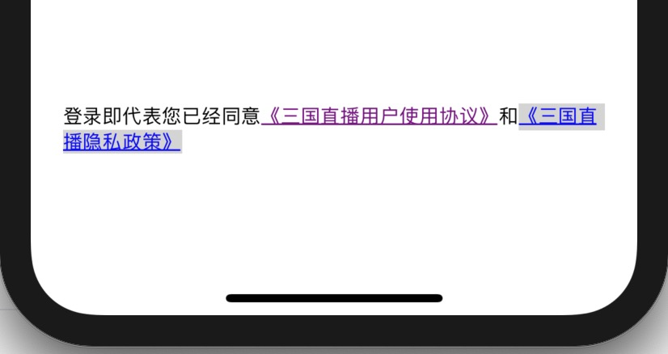

# RichTextClicked
富文本点击



富文本应该都比较熟悉，通过如下方法可以随时更改富文本状态

```
- (void)addAttribute:(NSAttributedStringKey)name value:(id)value range:(NSRange)range;
- (void)addAttributes:(NSDictionary<NSAttributedStringKey, id> *)attrs range:(NSRange)range;
- (void)removeAttribute:(NSAttributedStringKey)name range:(NSRange)range;

```

其中 `NSAttributedStringKey` 可以自定义，这样可以使富文本中包含更多信息，比如通过懒加载的方式初始化一个富文本 `attStr`

**OC**

```
-(NSMutableAttributedString *)attStr{
    
    if (!_attStr) {
        NSString* h1 = @"《三国直播用户使用协议》";
        NSString* h2 = @"《三国直播隐私政策》";
        NSString* str = [NSString stringWithFormat:@"登录即代表您已经同意%@和%@", h1, h2];
        _attStr = [[NSMutableAttributedString alloc] initWithString:str];
        
        NSMutableParagraphStyle* style = [[NSMutableParagraphStyle alloc] init];
        style.lineSpacing = 2;
        NSDictionary* attributes = @{NSFontAttributeName: [UIFont systemFontOfSize:12],
                                     NSParagraphStyleAttributeName: style };
        NSRange range = NSMakeRange(0, _attStr.length);
        [_attStr addAttributes:attributes range:range];
        
        NSDictionary* dic1 = @{ @"id": @"protocol", @"text": h1 };
        NSDictionary* dic2 = @{ @"id": @"strategy", @"text": h2 };
        NSDictionary* attributs1 = @{@"moreInfo": dic1, NSUnderlineStyleAttributeName: @(1), NSUnderlineColorAttributeName:[UIColor blueColor], NSForegroundColorAttributeName: [UIColor blueColor]};
        NSDictionary* attributs2 = @{@"moreInfo": dic2, NSUnderlineStyleAttributeName: @(1), NSUnderlineColorAttributeName:[UIColor blueColor], NSForegroundColorAttributeName: [UIColor blueColor]};
        [_attStr addAttributes:attributs1 range:[str rangeOfString:h1]];
        [_attStr addAttributes:attributs2 range:[str rangeOfString:h2]];

    }
    
    return _attStr;
}

```

**Swift**

```
    lazy var attStr: NSMutableAttributedString = {
        
        let h1 = "《三国直播用户使用协议》";
        let h2 = "《三国直播隐私政策》";
        let str = "登录即代表您已经同意" + h1 + "和" + h2
        let myAttStr = NSMutableAttributedString(string: str)
        let style = NSMutableParagraphStyle()
        style.lineSpacing = 2
        
        let attributes = [NSAttributedString.Key.font: UIFont.systemFont(ofSize: 12),
                          NSAttributedString.Key.paragraphStyle: style ]
        let range = NSMakeRange(0, myAttStr.length)
        myAttStr.addAttributes(attributes, range: range)
        
        let dic1 = ["id": "protocol", "text": h1]
        let dic2 = ["id": "strategy", "text": h2]
        
        let attributs1 = [NSAttributedString.Key(rawValue: "moreInfo"): dic1, NSAttributedString.Key.underlineStyle: 1, NSAttributedString.Key.underlineColor:UIColor.blue, NSAttributedString.Key.foregroundColor: UIColor.blue] as [NSAttributedString.Key : Any]
        let attributs2 = [NSAttributedString.Key(rawValue: "moreInfo"): dic2, NSAttributedString.Key.underlineStyle: 1, NSAttributedString.Key.underlineColor:UIColor.blue, NSAttributedString.Key.foregroundColor: UIColor.blue] as [NSAttributedString.Key : Any]

        myAttStr.addAttributes(attributs1, range: NSString(string: str).range(of: h1))
        myAttStr.addAttributes(attributs2, range: NSString(string: str).range(of: h2))
        
        return myAttStr
    }()
```

在字符串初始化的时候加入了额外的信息 `dic1`、`dic2`，这样在点击到富文本的时候可以取到附加信息。

在 `touchesBegan`、`touchesMoved`、`touchesEnded`  三个方法中，不断的 `remove`、`add` 属性，进而控制富文本的显示样式。

#### 获取点击位置的index
这里只要拿到点击文字的索引，就可以更改文字所在区域的显示样式了，方法如下：

**OC**

```
-(CFIndex)getIndexOfStringInLabel:(UILabel *)label point:(CGPoint)point {
    
    CGRect rect = label.bounds;
    CGPoint aPoint = CGPointMake(point.x, rect.size.height - point.y);
    
    NSUInteger index = NSNotFound;
    
    NSAttributedString *attStr = label.attributedText;
    CTFramesetterRef frameSetter = CTFramesetterCreateWithAttributedString((__bridge CFAttributedStringRef)attStr);
    
    CGMutablePathRef path = CGPathCreateMutable();
    
    CGPathAddRect(path, NULL, rect);
    CTFrameRef frame = CTFramesetterCreateFrame(frameSetter, CFRangeMake(0, attStr.length), path, NULL);
    CFArrayRef lines = CTFrameGetLines(frame);
    NSInteger numberOfLines = CFArrayGetCount(lines);
    
    CGPoint lineOrigins[numberOfLines];
    CTFrameGetLineOrigins(frame, CFRangeMake(0, numberOfLines), lineOrigins);
    for (CFIndex lineIndex = 0; lineIndex < sizeof(lineOrigins) / sizeof(lineOrigins[0]); lineIndex++) {
        
        CGPoint lineOrigin = lineOrigins[lineIndex];
        CTLineRef line = CFArrayGetValueAtIndex(lines, lineIndex);
        CGFloat ascent, descent, leading, width;
        width = CTLineGetTypographicBounds(line, &ascent, &descent, &leading);
        CGFloat yMin = floor(lineOrigin.y - descent);
        CGFloat yMax = ceil(lineOrigin.y + ascent);
        if (aPoint.y > yMax) {
            
            break;
        }
        
        if (aPoint.y >= yMin) {
            if (aPoint.x >= lineOrigin.x && aPoint.x <= lineOrigin.x + width) {
                CGPoint relativePoint = CGPointMake(aPoint.x - lineOrigin.x, aPoint.y - lineOrigin.y);
                index = CTLineGetStringIndexForPosition(line, relativePoint);
                break;
            }
        }
    }
    
    return index;
}

```

**Swift**

```
    func getIndexOfStringInLabel(label: UILabel, point: CGPoint) -> CFIndex {
        
        let rect = label.bounds
        let aPoint = CGPoint(x: point.x, y:rect.size.height - point.y)
        
        var index = NSNotFound
        
        let attributedStr = label.attributedText!
        let frameSetter = CTFramesetterCreateWithAttributedString(attributedStr)
        let path = CGMutablePath()
        path.addRect(rect)
        
        let frame = CTFramesetterCreateFrame(frameSetter, CFRangeMake(0, attributedStr.length), path, nil);
        let lines = CTFrameGetLines(frame);
        let numberOfLines = CFArrayGetCount(lines);
        
//        注意数组的初始化方式
        var lineOrigins = [CGPoint](repeating: .zero, count: numberOfLines)
        CTFrameGetLineOrigins(frame, CFRangeMake(0, 0), &lineOrigins)
        
        for lineIndex in 0 ..< lineOrigins.count {
            let lineOrigin = lineOrigins[lineIndex]
            
//            注意取值方式
            let line = Unmanaged<CTLine>.fromOpaque(CFArrayGetValueAtIndex(lines, lineIndex)).takeUnretainedValue()
            var ascent = CGFloat()
            var descent = CGFloat()
            var leading = CGFloat()
            let width = CTLineGetTypographicBounds(line, &ascent, &descent, &leading)
            
            let yMin = floor(lineOrigin.y - descent);
            let yMax = ceil(lineOrigin.y + ascent);
            if aPoint.y > yMax {
                
                break
            }
            
            if aPoint.y >= yMin {
                if (aPoint.x >= lineOrigin.x && aPoint.x <= lineOrigin.x + CGFloat(width)){
                    let relativePoint = CGPoint(x:aPoint.x - lineOrigin.x, y:aPoint.y - lineOrigin.y)
                    index = CTLineGetStringIndexForPosition(line, relativePoint)
                    break
                }
            }
        }
        
        return index;
    }

```

#### 获取点击位置的附加信息

**OC**

```
-(NSDictionary*)getClickInfoTouches:(NSSet<UITouch *> *)touches{

    UITouch* touch = touches.anyObject;
    CGPoint point = [touch locationInView:self.label];
    
    NSRange range = NSMakeRange(0, self.attStr.length);
    if (!CGRectContainsPoint(self.label.bounds, point)) {
        
        return nil;
    }
    
    CFIndex index = [self getIndexOfStringInLabel:self.label point:point];
    if (index == NSNotFound) {
        
        return nil;
    }
    
    if (index > self.attStr.length - 1) {
        
        return nil;
    }
    
    NSDictionary* info = [self.attStr attributesAtIndex:index effectiveRange:&range];
    
    if (![info[@"moreInfo"] isKindOfClass:[NSDictionary class]]) {
        return nil;
    }
    
    NSString* text = info[@"moreInfo"][@"text"];
    NSRange textRange = [self.attStr.string rangeOfString:text];
    
    if (index > textRange.location && index < textRange.location + textRange.length) {
        
        return info[@"moreInfo"];
    }
    return nil;
}
```

**Swift**

```
    func getClickInfoTouches(touches: Set<UITouch>) -> [String:Any]? {
        
        let touch = touches.first!
        let point = touch.location(in: attLabel)
        var range = NSMakeRange(0, attStr.length)
        if !attLabel.bounds.contains(point){
            return nil
        }
        
        let index = getIndexOfStringInLabel(label: attLabel, point: point)
        if index == NSNotFound {
            return nil
        }
        
        if index > attStr.length - 1 {
            return nil
        }
        
        let info = attStr.attributes(at: index, effectiveRange: &range)
        
        if  info.count == 0 {
            return nil
        }
      
//        let linkInfo = info[.link]
        let linkInfo = info[NSAttributedString.Key("moreInfo")]
        if !(linkInfo is Dictionary<String, Any>) {
            return nil
        }
        
        if linkInfo is Dictionary<String, Any> {
            let l_info = linkInfo as! Dictionary<String, Any>
            let text = l_info["text"] as! String
 
            let textRange = NSString(string: attStr.string).range(of: text)
            if index > textRange.location && index < textRange.location + textRange.length {
                return l_info
            }
        }

        return nil
    }
```

#### 更改显示样式
根据需要，控制显示样式，以下准备了三种样式 `高亮样式`、 `清空样式`、 `点击过的样式`

**OC**

```
-(void)highlightedBack{
    NSString* text = _currentInfo[@"text"];
    NSRange textRange = [self.attStr.string rangeOfString:text];
    UIColor* color = [[UIColor lightGrayColor] colorWithAlphaComponent:0.5];
    [self.attStr addAttribute:NSBackgroundColorAttributeName value:color range:textRange];
    self.label.attributedText = self.attStr;
}

-(void)removeAtt{
   
    NSRange range = NSMakeRange(0, self.attStr.length);
    [self.attStr removeAttribute:NSBackgroundColorAttributeName range:range];
    self.label.attributedText = self.attStr;
}

-(void)hasClickedAtt{
    
    NSString* text = _currentInfo[@"text"];
    NSRange textRange = [self.attStr.string rangeOfString:text];
    [self.attStr removeAttribute:NSForegroundColorAttributeName range:textRange];
    [self.attStr removeAttribute:NSUnderlineColorAttributeName range:textRange];
    [self.attStr removeAttribute:NSBackgroundColorAttributeName range:textRange];
    [self.attStr addAttribute:NSForegroundColorAttributeName value:[UIColor purpleColor] range:textRange];
    [self.attStr addAttribute:NSUnderlineColorAttributeName value:[UIColor purpleColor] range:textRange];
    
    self.label.attributedText = self.attStr;
}

```

**Swift**

```
    func highlightedBack(){
        
        if let info = _currentInfo {
            let text = info["text"] as! String
            let textRange = NSString(string: attStr.string).range(of: text)
            let color = UIColor.lightGray.withAlphaComponent(0.5)
            attStr.addAttribute(.backgroundColor, value: color, range: textRange)
            attLabel.attributedText = attStr
        }
    }
    
    func removeAtt() {
        let range = NSMakeRange(0, attStr.length)
        attStr.removeAttribute(.backgroundColor, range: range)
        attLabel.attributedText = attStr
    }
    
    func hasClickedAtt(){
        let text = _currentInfo!["text"] as! String
        let textRange = NSString(string: attStr.string).range(of: text)
        attStr.removeAttribute(.foregroundColor, range: textRange)
        attStr.removeAttribute(.underlineColor, range: textRange)
        attStr.removeAttribute(.backgroundColor, range: textRange)
        attStr.addAttribute(.foregroundColor, value: UIColor.purple, range: textRange)
        attStr.addAttribute(.underlineColor, value: UIColor.purple, range: textRange)
        attLabel.attributedText = attStr
    }

```

感谢您阅读完毕，如有疑问，欢迎添加QQ:**714387953**(蜗牛上高速)。
**github**:[https://github.com/yhl714387953/RichTextClicked](https://github.com/yhl714387953/RichTextClicked)
如果有错误，欢迎指正，一起切磋，共同进步
如果喜欢可以**Follow、Star、Fork**，都是给我最大的鼓励。
